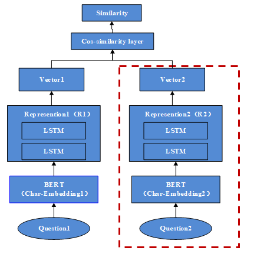
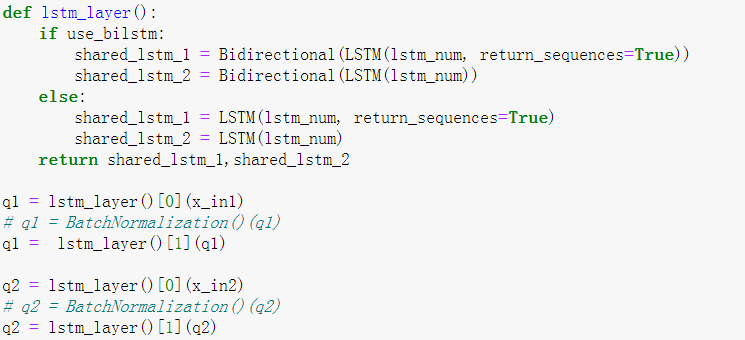
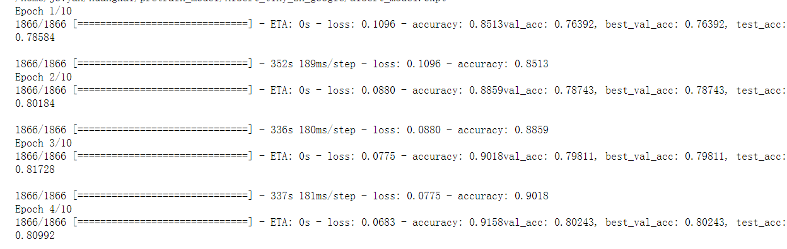

# finetune_bert_siamese

之前写了一个tensorflow1的版本，见
https://github.com/KATEhuang920909/bert-siamese-matching

最近摸索了一番写了一个bert-siamese的微调版本，
主要是基于keras，另外借鉴了苏神的bert4keras框架，整体结构看起来比t1干净多了。。

整体网络结构如下：



主要依赖包版本：
* Keras : 2.4.3
* Tensorflow:2.3.1
* bert4keras:0.9.5


目前业界在检索排序中大多采用双塔结构，这样可以对documents的向量做预存储，从而大大提高推理效率。
这里双塔模型的左右参数可以共享，非共享形式需要加载左右两套模型，分别作预处理和实时处理，而共享模型只
需加载一套模型，我这里采用了参数共享的方式。

## 输入层
```python
class data_generator(DataGenerator):
    """数据生成器
    """

    def __iter__(self, random=False, ):
        batch_token_ids, batch_segment_ids, batch_labels = [], [], []
        for is_end, (text1, text2, label) in self.sample(random):
            batch_token_id, batch_segment_id = [], []
            token_ids, segment_ids = tokenizer.encode(text1, maxlen=maxlen)
            batch_token_id.append(token_ids)
            batch_segment_id.append(segment_ids)
            token_ids, segment_ids = tokenizer.encode(text2, maxlen=maxlen)
            batch_token_id.append(token_ids)
            batch_segment_id.append(segment_ids)
            batch_token_ids.append(batch_token_id)
            batch_segment_ids.append(batch_segment_id)
            batch_labels.append([float(label)])
            if len(batch_token_ids) == self.batch_size or is_end:
                batch_token_ids = np.array([sequence_padding(k, length=maxlen) for k in batch_token_ids])
                batch_segment_ids = np.array([sequence_padding(k, length=maxlen) for k in batch_segment_ids])
                batch_labels = sequence_padding(batch_labels)
                yield [batch_token_ids, batch_segment_ids], batch_labels
                batch_token_ids, batch_segment_ids, batch_labels = [], [], []
```
输入层对文本对做处理，shape为[(None,2,maxlen),(None,2,maxlen)],(None,1)

```python
input_tokens_id = Input(shape=(2, maxlen))
input_segments_id = Input(shape=(2, maxlen))
```

## bert层
```python
x_in1 = bert_model([input_tokens_id[:, 0, :], input_segments_id[:, 0, :]])
x_in2 = bert_model([input_tokens_id[:, 1, :], input_segments_id[:, 1, :]])
```
这里对句子对做处理，分别得到token_id和segments_id，shape均为(None,2,maxlen)，然后做切片操作，分别送入bert模型中，x_in1,x_in2的shape均为
(None,maxlen,768)，

##lstm层
这里可采用共享参数或者非共享参数的方式：
非共享：

共享：
```python
if use_bilstm:
    shared_lstm1 = Bidirectional(LSTM(lstm_num, return_sequences=True))
    shared_lstm2 = Bidirectional(LSTM(lstm_num))
else:
    shared_lstm1 = LSTM(lstm_num, return_sequences=True)
    shared_lstm2 = LSTM(lstm_num)
q1 = shared_lstm1(x_in1)
q1 = shared_lstm2(q1)
q2 = shared_lstm1(x_in2)
q2 = shared_lstm2(q2)
```

## 输出层
输出层使用cosine值作为输出,也可以接softmax。
```python
def cosine_distance(vects):
    x, y = vects
    x = K.l2_normalize(x, axis=-1)
    y = K.l2_normalize(y, axis=-1)
    return 1 - merge.dot([x, y], axes=1, normalize=True)
distance = Lambda(cosine_distance, output_shape=dist_output_shape)([q1, q2])
```

## loss &optimizer
* loss采用对比损失函数contrastive_loss
* optimizer 采用AdamLR,分段线性学习率，学习率逐渐降低，加快收敛并提高泛化性


run


最终在测试集上的准确率82.9%,可以调参进一步提高准确率


总结：

**主要是里面的预处理以及切片操作，整体结构也较为简单**

